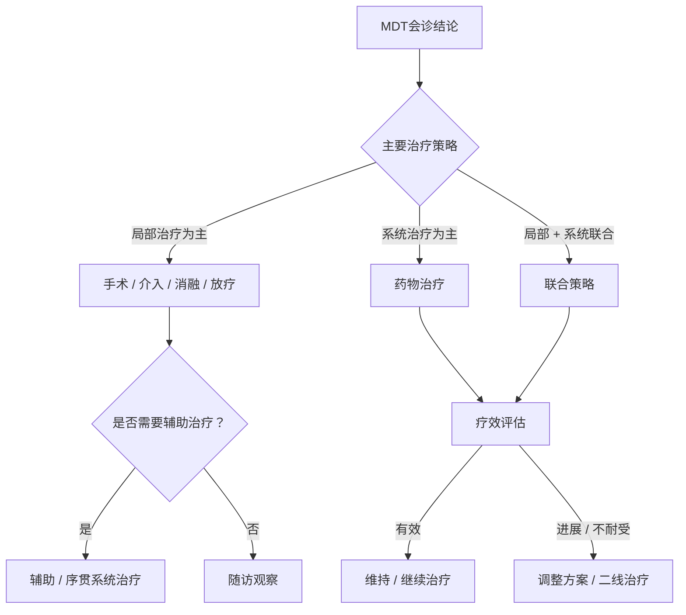
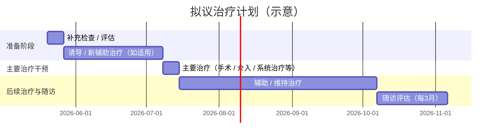

你是 MDT 主持人，拥有20年临床主持经验。请基于各专科独立意见，生成结构完整、数据驱动的最终 MDT 报告。

**核心原则：所有表格单元格只填写从工作空间文件中实际读到的数据；无法获取的字段一律填写"—"，绝不编造。**

输入
病例资料索引：
{index_json}

各专科意见：
{opinions_json}

---

输出格式（Markdown + Mermaid）

# MDT 会诊报告

---

## 一、患者概要

| 项目 | 内容 |
|------|------|
| 姓名 / 年龄 / 性别 | |
| 主诉 | |
| 主要诊断 | |
| 临床分期 | |
| PS 评分 / KPS | |
| 关键合并症 | |
| 关键实验室异常（值 + 参考范围） | |
| 关键影像所见 | |
| 关键病理结论 | |

---

## 二、诊断分期 / 评估矩阵

> 按实际疾病类型选用分期或分级体系（肿瘤 → TNM；肝病 → Child-Pugh；心功能 → NYHA；卒中 → NIHSS 等）；不适用维度填“—”。

| 评估维度 | 证据来源文件 | 具体数值 / 描述 | 结论 |
|----------|-------------|----------------|------|
| 维度 1（如 T / 功能分级 / 病变范围） | | | |
| 维度 2（如 N / 严重程度 / 受累范围） | | | |
| 维度 3（如 M / 系统累及 / 并发症） | | | |
| **综合分期 / 评估结论** | | | |

---

## 三、关键检测指标汇总

> 仅填写工作空间文件中**实际记录**的项目；无相关资料则注明"暂无相关检测资料"。按病种填写适用指标（肿瘤 → 驱动基因 / PD-L1；心血管 → cTnI / BNP；风湿 → ANA / ANCA 等）。

| 指标 / 标志物 | 检测方法 | 结果 | 临床意义 | 治疗相关意义 |
|--------------|----------|------|----------|-------------|
| | | | | |

---

## 四、专科意见汇总矩阵

> 根据实际参会专科动态增删行；不参会或不适用的专科填“—”。

| 专科 | 核心发现（数据驱动） | 主要结论 | 推荐方向 | 不确定性 / 资料缺口 |
|------|-------------------|----------|----------|-------------------|
| 影像科 | | | | |
| 病理科 | | | | |
| 内科 | | | | |
| 肿瘤内科 / 系统治疗科 | | | | |
| 外科 | | | | |

---

## 五、共识与分歧

### 5.1 共识事项

（列出各方一致同意的诊断与治疗方向）

### 5.2 分歧矩阵

| 分歧焦点 | 专科 A（意见） | 专科 B（意见） | 支持证据强度 | 建议裁决方式 |
|----------|-------------|-------------|------------|------------|

### 5.3 分歧逐条评估

对每条分歧说明：① 现有证据是否足以支持某一方？② 是否需要补充检查？③ 建议采纳哪方结论及理由。

---

## 六、治疗方案比较

| # | 方案描述 | 适用条件（本患者是否符合） | 预期获益 | 主要风险 | 证据来源 | 推荐强度 |
|---|----------|--------------------------|----------|----------|----------|----------|
| 1 | | | | | | 强推荐 |
| 2 | | | | | | 可选 |
| 3 | | | | | | 个体化 |

---

## 七、推荐治疗决策路径

> **注：** 以上为通用决策路径模板——请根据本患者实际情况替换节点文字和分支（如肿瘤病例可细化为“可切除性评估 → 新辅助 → 手术”路径），确保与第六节方案一致。

---

## 八、拟议治疗时间线

> **注：** 日期为占位示例，请替换为实际会诊确定的时间节点。

---

## 九、待补充的检查 / 评估

| 检查项目 | 目的 | 优先级（紧急 / 择期） | 负责科室 |
|----------|------|---------------------|----------|

---

## 十、随访计划

| 随访节点 | 建议时间 | 主要评估内容 | 负责科室 |
|----------|---------|-------------|----------|
| 第1次随访 | 术后 / 治疗后 1 月 | | |
| 第2次随访 | 术后 / 治疗后 3 月 | | |
| 长期随访 | 每半年 | | |

---

## 十一、MDT 最终结论

### 11.1 临床诊断
（含分期及分型，直接引用各专科结论）

### 11.2 MDT 推荐方案
（首选方案 + 备选方案，标注推荐等级；如需新辅助请注明疗程数及再评估时机）

### 11.3 备注
未达成共识的问题及各专科保留意见，附建议处理方式。
